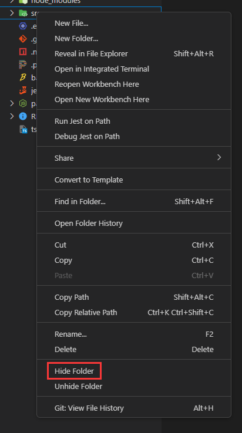
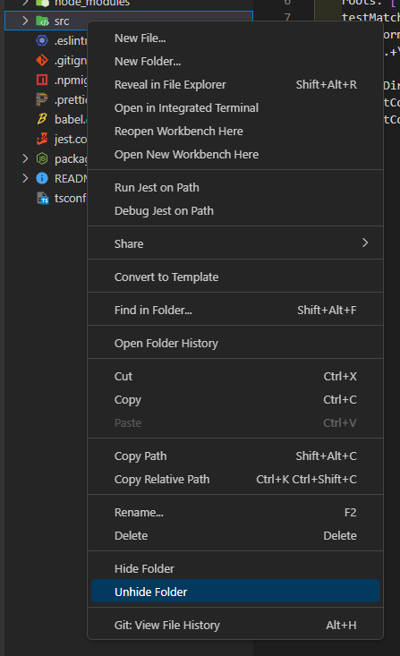
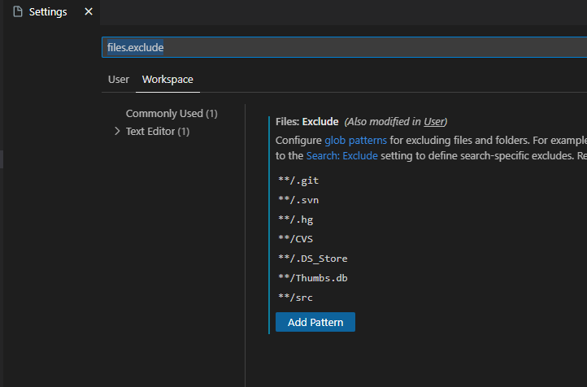

# Folder-Hide

Folder-Hide is a Visual Studio Code extension that allows you to hide and unhide folders in your workspace using a simple shortcut.

To hide folder, right-click a folder and select `Hide Folder`. Note: Hiding folders using glob patterns may affect the behavior of other extensions or tools that rely on the file structure. Before hiding a folder, consider whether doing so may cause unintended side effects.

To unhide folder, right click anywhere in the explorer and select `Unhide Folder`

Use the workspace settings to remove the hidden folder glob pattern if you want to unhide a previously hidden folder. This will allow the folder to be displayed in the Explorer view again.

